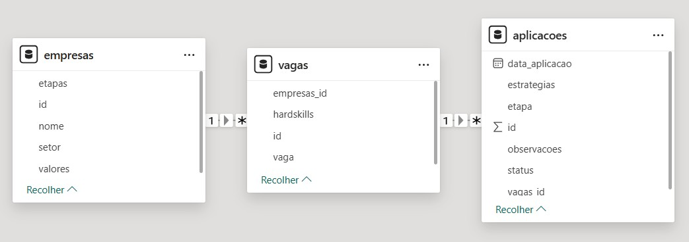
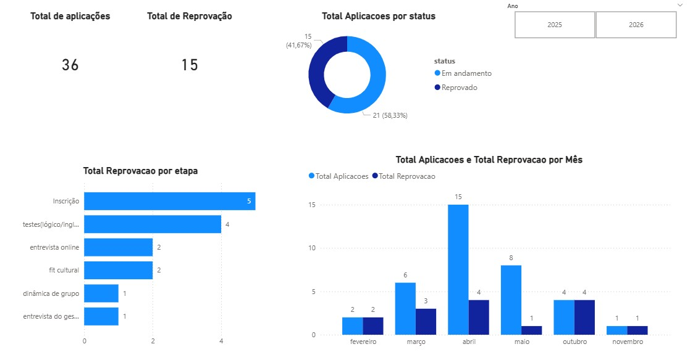

# Career Analytics Tracker — Análise de Transição de Carreira


> ⚡ **Sistema em operação** — dados reais de processos seletivos ativos, atualizados continuamente durante a transição de carreira.

---

## 🎯 Problema de Negócio

Candidatos em transição de carreira tomam decisões de candidatura com base em intuição — sem visibilidade sobre quais etapas concentram mais reprovações, quais estratégias realmente funcionam ou quais perfis de vaga têm maior aderência ao seu perfil.

Este projeto cria um **sistema de rastreamento analítico** que registra, estrutura e analisa os próprios processos seletivos em tempo real, transformando dados de candidatura em inteligência estratégica para otimizar as próximas aplicações.

> **Pergunta central:** O que aumenta minhas chances de avançar nos processos seletivos? Em qual etapa estou sendo barrado e por quê?

---

## 🔍 Principais Achados

> Base atual: **36 aplicações · 28 empresas · 37 vagas monitoradas**

| # | Achado | O que isso significa |
|---|---|---|
| 1 | **56% das reprovações ocorrem antes da 1ª entrevista** — Inscrição (5) + Testes (4) | Gargalo nos filtros ATS: o currículo não estava passando pela triagem automatizada antes de chegar a um humano |
| 2 | **Currículo ajustado com IA isolado → 6 reprovações, 0 avanços** | Otimizar apenas o currículo não é suficiente para vencer os filtros iniciais |
| 3 | **Combinação currículo + portfólio + networking → 3 em andamento, 0 reprovações** | Quanto mais estratégias combinadas, maior a taxa de avanço — evidência direta de que a stack de candidatura importa |

---

## ⭐ Diferenciais Técnicos deste Projeto

| Diferencial | Por que importa |
|---|---|
| **Dados reais de processos seletivos ativos** | Não é simulação — são candidaturas reais com resultados rastreados em tempo real |
| **Modelagem relacional com 3 tabelas** | Empresas → Vagas → Aplicações com chaves estrangeiras — simula modelagem de banco corporativo |
| **Views SQL para análises recorrentes** | 4 views criadas para consultas padronizadas sem repetição de código |
| **Uso de dados para otimizar a própria carreira** | Demonstra pensamento analítico aplicado a um problema real e pessoal |

---

## 💡 Impacto Gerado

Com o sistema operacional, foi possível:

- **Identificar o gargalo** nas etapas iniciais e ajustar o currículo para passar pelos filtros ATS
- **Validar empiricamente** que mais estratégias combinadas resultam em maior taxa de avanço
- **Mapear padrões** entre empresas, setores e tipos de vaga com melhor aderência ao perfil
- **Orientar os próximos estudos** com base nas hard skills mais exigidas pelas vagas candidatadas

---

## 🗄️ Modelagem Relacional

O banco foi estruturado em 3 tabelas relacionadas para eliminar redundância e permitir análises cruzadas:

```
empresas (id, nome, setor, valores)
    │
    └── vagas (id, empresas_id, vaga, hardskills)
              │
              └── aplicacoes (id, vagas_id, data_aplicacao, etapa, estrategias, observacoes, status)
```

<p align="center">
  
</p>

---

## 📊 Dashboard

<p align="center">
  
</p>

- **Volume de aplicações ao longo do tempo:** pico em abril/2026 com 15 aplicações — sprint de candidatura
- **Reprovações por etapa:** identifica onde o funil quebra — concentração em Inscrição e Testes
- **Estratégias × resultado:** correlação entre combinação de estratégias e taxa de avanço
- **Empresas e vagas com maior aderência:** orienta onde focar as próximas candidaturas

---

## 📂 Estrutura do Projeto

```
Analise_transição_carreira/
├── data/
│   ├── aplicacoes.csv        # Exportado automaticamente pelo pipeline
│   ├── vagas.csv
│   └── empresas.csv
├── database/
│   └── carreira.db           # Banco SQLite com as 3 tabelas e 4 views
├── dashboard/
│   ├── visual_aplicacoes.jpg # Dashboard exportado do Power BI
│   └── esquema_relacional.jpg
├── scripts/
│   ├── exportar_dados.py     # Pipeline de exportação do banco para CSV
│   └── consultas.sql         # Consultas analíticas organizadas por tema
├── requirements.txt
└── README.md
```

---

## 🚀 Como Reproduzir

```bash
# 1. Clone o repositório
git clone https://github.com/Luizcomzz/Analise_transicao_carreira.git
cd Analise_transicao_carreira

# 2. Crie e ative o ambiente virtual
python -m venv venv
venv\scripts\activate        # Windows
# source venv/bin/activate   # Mac/Linux

# 3. Instale as dependências
pip install -r requirements.txt

# 4. Popule o banco com seus dados de candidatura via SQLite
#    (use as tabelas empresas → vagas → aplicacoes)

# 5. Exporte os dados para CSV (integração com Power BI)
python scripts/exportar_dados.py
```

---

## 📈 KPIs Monitorados

| Indicador | Resultado atual |
|---|---|
| Total de aplicações | 36 |
| Empresas distintas | 28 |
| Vagas monitoradas | 37 |
| Processos em andamento | 21 (58%) |
| Processos reprovados | 15 (42%) |
| Principal gargalo | Inscrição — 5 reprovações |
| Melhor combinação de estratégias | Currículo IA + Teste IA + Networking + Portfólio GitHub |

---

## 🔎 Consultas SQL — Organizadas por Tema

| Arquivo | Conteúdo |
|---|---|
| `scripts/consultas.sql` — Visão Geral | Total de aplicações, empresas, vagas e status |
| `scripts/consultas.sql` — Performance | Reprovações por etapa, taxa de avanço, empresas com mais aplicações |
| `scripts/consultas.sql` — Estratégias | Estratégias utilizadas × resultado obtido |
| `scripts/consultas.sql` — Mercado | Hard skills mais pedidas, empresas por setor |
| `scripts/consultas.sql` — Views | 4 views analíticas para consultas recorrentes |

---

## 🗺️ Evoluções Planejadas

### Curto prazo
- Padronizar hard skills em tabela separada (atualmente em texto corrido)
- Estruturar etapas do processo em níveis ordenados para análise de funil

### Médio prazo
- Automação da entrada de dados via formulário ou planilha integrada
- Comparação entre tipos de vaga (analista, cientista, engenheiro de dados)

### Longo prazo
- Sistema preditivo de aderência às vagas com base no histórico
- Recomendação automática de estratégias por perfil de empresa

---

## 🛠️ Tecnologias Utilizadas

| Ferramenta | Finalidade |
|---|---|
| [Python 3.14](https://www.python.org/) | Pipeline de exportação dos dados |
| [Pandas](https://pandas.pydata.org/) | Leitura e exportação das tabelas do banco |
| [SQLite](https://sqlite.org/) | Banco relacional com modelagem de 3 tabelas e views |
| [Power BI](https://www.microsoft.com/pt-br/power-platform/products/power-bi/desktop) | Dashboard de acompanhamento do funil de candidaturas |

---

## 👤 Autor

Desenvolvido por **Luiz** · [LinkedIn](https://linkedin.com/in/seu-perfil) · [GitHub](https://github.com/Luizcomzz)
